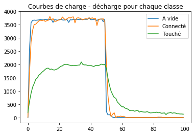
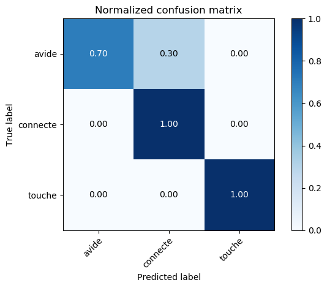

# conduction_galvanique

## Premiers résultats

On a labélisé 3 classes :

* A vide : rien est en contact avec le capteur,
* Connecté : on met le doigt dans le capteur,
* Touché : on touche l'ordinateur avec son doigt.

Ci-dessous on peut observer les différences de charge - décharge pour chaque classe.

Puis on entraine un réseau de neuronnes LSTM sur environ 300 séquences (100 pour chaque classe) (cf : [model.py](model.py)).
On peut visualiser les résultats de prédiction avec la matrice de confusion suivante :

Le réseau confond un peu la classe "à vide" avec la classe "connecté". Cela est cohérent avec le fait qu'elles se ressemblent beaucoup. Avec plus d'entraînement et plus de séquences dans la base de données on pourrait améliorer les résultats.