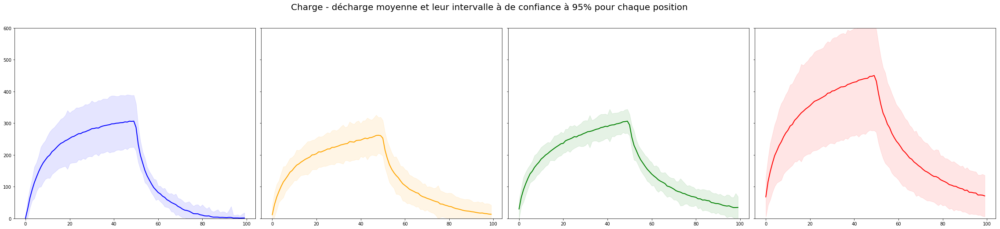

# conduction_galvanique

## Premiers résultats

On a labélisé 3 classes :

* A vide : rien est en contact avec le capteur,
* Connecté : on met le doigt dans le capteur,
* Touché : on touche l'ordinateur avec son doigt.

Ci-dessous on peut observer les différences de charge - décharge pour chaque classe.

Puis on entraine un réseau de neuronnes LSTM sur environ 300 séquences (100 pour chaque classe) (cf : [model.py](model.py)).
On peut visualiser les résultats de prédiction avec la matrice de confusion suivante :

Le réseau confond un peu la classe "à vide" avec la classe "connecté". Cela est cohérent avec le fait qu'elles se ressemblent beaucoup. Avec plus d'entraînement et plus de séquences dans la base de données on pourrait améliorer les résultats.

## Clavier

On a dessiné un "clavier" sur un bras. L'idée étant de pouvoir détecter sur quelle "touche" on appuie avec notre doigt. On a touche labélisé 4 touches et le cas où on ne touche pas.

Ci-dessous on peut observer les différences de charge - décharge pour chaque classe.

On entraîne de la même manière un réseau de neuronnes LSTM sur environ 1000 séquences (200 pour chaque classe). On peut visualiser les résultats de prédiction avec la matrice de confusion suivante :

Le réseau reconnait parfaitement la classe "pas touche" car elle diffère énormément des autres classes. La classe "touche 3" est aussi très bien détectée avec 96% de bonnes détections. En revanche, les 3 premières classes sont très mal détectée car elles se ressemblent beaucoup trop.

## Parties éloignées du corps

On a donc essayer la même procédure avec des positions plus éloignées sur le corps (poignet, avant-bras gauches et droits). Les résultats ne sont pas concluants comme le montre la matrice de confusion suivante :

Pour comprendre ces mauvais résultats, il suffit de regarder les courbes de charge - décharge moyennes ainsi que les écarts à la moyenne (cf. figure ci-dessous). On remarque que les écarts types sont trop élevés. Ainsi, les classes "se chevauchent" et le réseau ne peut donc pas apprendre à les différencier. Il s'agit donc d'un problème d'aquisition des données.

